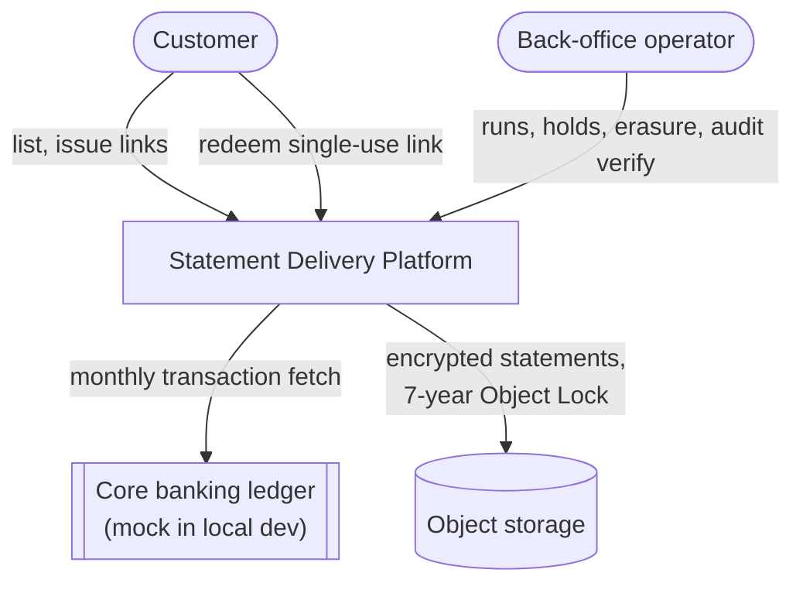

# Secure Statement Delivery Platform

[](https://github.com/NWF007/statement-delivery-system/actions/workflows/ci.yml)

Account statements are among the most sensitive documents a bank holds, and they are subject to
a seven-year regulatory retention period. This platform generates them at a scale of roughly
**30 million a month**, stores them encrypted under a **write-once compliance lock**, and
delivers them through **single-use, time-limited links** with a tamper-evident audit trail.

The hardest constraint is not throughput. It is that objects under a Compliance-mode Object
Lock **cannot be deleted by anyone** — so when a customer exercises their POPIA right to
erasure inside the retention window, deletion is unavailable. The system resolves this with
per-customer key destruction: the ciphertext remains, permanently unreadable. That one
requirement drove the encryption architecture (a three-tier key hierarchy), which drove the
delivery architecture (decrypt-and-stream through a gateway, never presigned URLs), which is
why this README leads with the threat model rather than a feature list.

## Threat model

This is a security system and was built as one — the full STRIDE analysis, per boundary, with
the mitigating test named per threat, is in **[docs/THREAT-MODEL.md](docs/THREAT-MODEL.md)**.
The shape of it:

| Boundary | Representative threat | Answer |
| --- | --- | --- |
| Public gateway | Stolen/replayed link; denial oracles | Single-use CSPRNG tokens, hashed at rest, atomic consume; ONE uniform 404 with a 50 ms timing floor |
| Customer API | IDOR; data leaking through responses | Ownership as a WHERE-clause predicate on the JWT subject; 404-not-403; leak-probe tests on every contract |
| Object storage | Tampering; early deletion | Framed AEAD with identity-binding AAD; Object Lock COMPLIANCE, refused as GOVERNANCE outside Development |
| Database | Audit rewritten to hide access | Insert-only grants, tamper trigger, 16 sharded hash chains, re-verifiable end to end |
| Key hierarchy | CEK theft; unlawful erasure | Keys stored only wrapped under KMS KEKs; a pure decision engine where a legal hold outranks everything |
| Logs / telemetry | Secrets in logs, traces, metric labels | A central redactor and closed-set labels, enforced by tests |
| The future | An endpoint added without auth | An `EndpointDataSource` enumeration test: every route authorised or on a justified allow-list |

**The one open item is named, not hidden**: audit chain heads live beside the events they
attest, so a sufficiently privileged insider could forge a self-consistent chain. The seam for
external anchoring exists (`IChainAnchor`); the limitation and its acceptance rationale are in
[docs/LIMITATIONS.md](docs/LIMITATIONS.md).

## The problem

Two subsystems with opposite scaling profiles, which is the single most important architectural
fact about the domain:

|  | Generation | Delivery |
| --- | --- | --- |
| Shape | Monthly burst, ~1,400 renders/sec | Steady ~0.5 req/sec, ~30 peak |
| Mode | Async batch, resumable | Synchronous, sub-second |
| Failure | Retry silently | Immediately user-visible |
| Optimise for | Throughput | Correctness and audit |

Coupling them would mean sizing the customer-facing API fleet for month-end batch load. That is
the single most important reason this is a microservices solution rather than a modular monolith,
and it is written up in [ADR-0001](docs/adr/0001-microservices-over-modular-monolith.md).

## Quickstart

```bash
git clone https://github.com/NWF007/statement-delivery-system.git
cd statement-delivery-system
cp .env.example .env
docker compose up --build
```

That is the whole procedure. No manual steps, no seeding, no waiting and retrying: every
dependency declares a health check, the migrator runs once and gates everything behind it, and
the services start only after it exits `0`.

| What | Where |
| --- | --- |
| Delivery API (authenticated) | <http://localhost:8081> |
| Delivery API — OpenAPI / Scalar | <http://localhost:8081/scalar/v1> |
| Download Gateway (public) | <http://localhost:8082> |
| Aspire Dashboard — traces, metrics, logs | <http://localhost:18888> |
| MinIO Console | <http://localhost:9001> |
| PostgreSQL (direct — migrator only) | `localhost:5432` |
| PgBouncer (what services actually use) | `localhost:6432` |

Verify it:

```bash
docker compose ps db-migrator                  # Exited (0)
curl -f http://localhost:8081/health/live      # process is alive
curl -f http://localhost:8081/health/ready     # dependencies are reachable
curl -f http://localhost:8082/health/live
curl -f http://localhost:8082/health/ready
curl -s http://localhost:8081/ping | jq        # service, version, environment, utcNow
```

Then open <http://localhost:18888> and confirm all four services are reporting traces, metrics and
structured logs. The `traceId` in a JSON log line on stdout matches the trace in the dashboard —
that is the point of the correlation wiring.

Stop and wipe:

```bash
docker compose down --volumes
```

### Exercising the read/write split

`postgres-replica` is behind a compose profile, so it does **not** start by default and
`ConnectionIntent.ReadEventual` falls back to the primary — logged as a warning at startup rather
than silently. To run the split for real:

```bash
docker compose --profile replica up -d postgres-replica
```

then set `POSTGRES_REPLICA_CONNECTION` for the services that should use it; `.env.example` has the
connection string. Note that `ReadEventual` is for catalogue reads only: a read that gates an access
decision must run inside the caller's transaction, which is ADR-0024 and is enforced by an
architecture test.

### Running without Docker

Every service **fails fast** if it is not fully configured — `ValidateDataAnnotations()` plus
`ValidateOnStart()`, so a missing connection string stops startup instead of surfacing on the
first request. Running `dotnet run` outside compose therefore needs the same environment variables
compose supplies; `.env.example` lists all of them.

## Architecture

**System context** — who talks to what:



**Container view** — the deployables and their one-direction dependencies:


Everything except the migrator reaches PostgreSQL through PgBouncer. That is not a preference:
without it the 400-replica generation fleet alone would ask for ~2,000 backends against a server
whose practical ceiling is in the low hundreds.
See [ADR-0008](docs/adr/0008-pgbouncer-transaction-pooling.md).


**The download sequence** — the path everything else exists to protect:

```mermaid
sequenceDiagram
    participant C as Customer
    participant A as Delivery.Api
    participant G as Download.Gateway
    participant P as PostgreSQL
    participant S as Object storage

    C->>A: POST /statements/{id}/download-links (JWT)
    A->>P: insert SHA-256(token), audit LINK_ISSUED (one txn)
    A-->>C: 201 url with plaintext token (exists nowhere else)
    C->>G: GET /v1/d/{token}
    G->>P: atomic consume UPDATE..RETURNING + audit DOWNLOAD_STARTED (one txn)
    Note over G,P: exactly one concurrent redeemer wins
    G->>S: GET ciphertext (streamed)
    G-->>C: 200 PDF - decrypted and tag-verified frame by frame
    C->>G: same link again
    G-->>C: 404 (uniform; real reason only in the audit trail)
```

## Services

| Service | Port | Why it is a separate deployable |
| --- | --- | --- |
| **Delivery.Api** | 8081 | Authenticated, interactive, customer-facing. Scales with application traffic. |
| **Download.Gateway** | 8082 | Deliberately unauthenticated — the token is the credential. Different threat exposure and a different auth model. Isolating it means a flood against the public endpoint cannot exhaust the authenticated API's capacity. |
| **Generation.Worker** | — | Scales 0 → 400 replicas monthly. Coupling it to the API would mean sizing the API fleet for month-end. |
| **Retention.Worker** | — | Runs destructive operations. Separate deployment, separate identity, separate approval path. The code that deletes data should not share a process with the code that serves it. |

Shared building blocks live in `src/BuildingBlocks`:

| Project | What it owns |
| --- | --- |
| `ServiceDefaults` | OpenTelemetry, health checks, resilience, service discovery, JSON logging with redaction, RFC 9457 problem details, graceful shutdown. Every service's `Program.cs` is about fifteen lines because of it. |
| `Domain` | Statements, periods, retention policy, the audit hash-chain definition, strongly-typed identifiers. **References nothing at all** — no Npgsql, no ASP.NET Core, not even `Microsoft.Extensions.*`. Enforced by `DomainPurityTests`. |
| `Persistence` | Connection routing by intent, repositories, unit of work, the audit writer and verifier, distributed leases, UUIDv7 generation, binary COPY bulk writes, partition maintenance. Never references ASP.NET Core. |
| `Messaging` | Publisher abstraction and the transactional outbox contract. |
| `Contracts` | Integration event contracts. No project and no package references, ever. |

## Query discipline

Five rules, each describing a query that works on a laptop against a thousand rows and falls over
on a table holding 2.5 billion. They are **enforced by tests**, not just documented —
`tests/ArchitectureTests/QueryDisciplineTests.cs`.

| Rule | Why |
| --- | --- |
| **Keyset pagination only. Never `OFFSET`.** | `OFFSET` on a live table with concurrent inserts produces duplicates and gaps, degrades linearly, and defeats partition pruning. `Paging/Cursor.cs` carries the partition key so page two prunes as well as page one. |
| **Every query has an explicit timeout.** | A query with no timeout holds a pooled connection — and behind PgBouncer that is one of a few dozen shared by the whole fleet. One unbounded query becomes everybody's outage. |
| **Never `SELECT *`. Column lists only.** | Adding a column silently changes the shape of every result set that touches the table, including making a column that was never meant to leave the database appear in a projection nobody re-reviewed. |
| **No `LIST`-style unbounded scans.** | Every object in storage is reached by a key computed from the database. At 2.5 billion objects a listing is not slow, it is unusable — and billed per request. |
| **Slow queries visible in development.** | The local PostgreSQL container runs `log_min_duration_statement=200`. Finding out in production that nothing was logging slow queries is the wrong time. |

The reasoning, with the SQL shapes, is in
[`src/BuildingBlocks/Persistence/README.md`](src/BuildingBlocks/Persistence/README.md). Read the
**transaction-pooling trap list** at the top of `Connections/NpgsqlConnectionFactory.cs` before
writing any SQL at all — five PostgreSQL features do the wrong thing behind a transaction pooler,
silently, and only under load.

## Why the encryption design exists: erasure inside an immutable store

The strongest single argument in this system is a chain of three facts:

1. Statements are written under **S3 Object Lock in Compliance mode** — for seven years, no
   principal, not an administrator, not the root account, can delete them. That is what makes
   them a regulatory record (FICA s23, Companies Act) rather than files with a policy attached.
2. POPIA s24 gives a customer the right to erasure — and that right does not pause for a
   retention schedule's storage mechanics. When it applies, deletion is not merely
   inconvenient. **It is impossible.**
3. Every statement is encrypted under a per-customer key (a three-tier hierarchy: cohort KEK in
   KMS → per-customer CEK → per-object DEK). Destroy that one key — one row, one operation,
   after a seven-day cooling-off window and a re-check for legal holds — and every copy of that
   customer's statements everywhere becomes permanently unreadable: live, versioned, backed up,
   replicated, archived. The objects stay exactly where the law requires them to stay; they are
   now indistinguishable from random bytes.

Crypto-erasure is therefore not an optimisation or a clever trick here. It is the **only
mechanism available** — a cryptographic architecture chosen to satisfy a statutory obligation
that no storage-layer mechanism could. The proof is a test:
`Erasure_MakesStatementPermanentlyUndecryptable` destroys the key, confirms the ciphertext
still exists, and confirms nothing can read it. See ADR-0020 (the hierarchy and its
arithmetic), ADR-0035 (the cooling-off window) and ADR-0036 (why the metadata survives).

## Key design decisions

The full index — 42 ADRs, grouped by theme — is [docs/adr/README.md](docs/adr/README.md).
The five with the most reasoning behind them:

1. **Proxy delivery, never presigned URLs** — the standard argument for presigned URLs is
   bandwidth offload, and the arithmetic says peak delivery bandwidth here is ~6 MB/s (~$22/month
   of egress). That buys nothing, and a presigned URL cannot do per-frame decryption, uniform
   denials or consume-before-stream. Driven by the cost model, not preference —
   [ADR-0015](docs/adr/0015-unauthenticated-redemption-endpoint.md),
   [ADR-0017](docs/adr/0017-consume-before-stream.md), [docs/COST.md](docs/COST.md).
2. **Envelope encryption over SSE-KMS** — SSE-KMS decrypts for anyone with bucket access and
   cannot erase anything. Client-side envelope encryption is what makes crypto-erasure real:
   destroy one key row, and every copy — live, versioned, backed up — becomes unreadable at once.
   [ADR-0021](docs/adr/0021-envelope-encryption-over-sse-kms.md).
3. **A framed AEAD, because .NET's `AesGcm` cannot stream** — one-shot GCM would mean buffering
   whole statements in memory per request. SDP1 frames carry per-frame tags with the statement's
   identity in the AAD, so the gateway authenticates as it streams in O(1) memory.
   [ADR-0019](docs/adr/0019-framed-aead-over-one-shot-gcm.md).
4. **The three-tier key hierarchy, from the $26M/month arithmetic** — one KMS key per customer
   is the clean erasure design and costs 26M × $1/month. Cohort KEKs in KMS (~$1k/month) wrapping
   per-customer CEKs in the database splits the difference and keeps erasure per-customer.
   [ADR-0020](docs/adr/0020-three-tier-key-hierarchy.md).
5. **Legal conflicts are surfaced with their statutory basis, never resolved in code** — a pure
   decision engine encodes the precedence (hold > Object Lock > statute), exhaustively tested,
   and every refusal cites the law and the date: *409 — cannot erase: FICA s23 requires retention
   until 2031-03-14*. [ADR-0033](docs/adr/0033-legal-conflict-surfaced-not-resolved.md).

## The audit trail, and the limit of what it proves

Every read, and **every denial**, is recorded in a hash-chained audit trail: each record's hash
covers its predecessor's, so removing or altering one breaks every hash after it. The chain is
sharded sixteen ways because ordering means serialisation and a single global chain would be the
throughput ceiling for the whole platform.

**What it does not prove, stated plainly.** The chain proves nothing was deleted or altered *within
a chain*, **given a trusted terminal hash**. But the chain heads live in the same database as the
events. An attacker with enough privilege to rewrite both can produce a self-consistent forgery, and
truncation from the tail is undetectable from inside. Closing that gap needs terminal hashes
anchored **outside** the database — append-only object storage under Object Lock, or an account with
independent credentials. `IChainAnchor` is the seam; the implementation is deferred and carries a
`TODO(security)`. Until it ships, treat verification as evidence against application bugs and
opportunistic tampering, **not** against a privileged insider.
See [ADR-0010](docs/adr/0010-sharded-audit-hash-chains.md).

## What this does not do

Explicit non-goals, each a decision rather than an omission:

- **HTTP Range requests** — a resumable download conflicts with single-use tokens; the tokens
  won ([ADR-0016](docs/adr/0016-no-range-request-support.md)).
- **Automatic orphan deletion** — the sweep reports, permanently; inventory-driven deletion is
  how comparison bugs destroy data ([ADR-0039](docs/adr/0039-orphan-sweep-reports-does-not-delete.md)).
- **KMS key rotation** — `kek_id` per object and the cohort index exist so rotation never
  rewrites history; the rotation job itself is future work.
- **A real message broker** — the transactional outbox is real; its transport is a logging sink
  until a consumer exists ([ADR-0026](docs/adr/0026-postgres-queue-over-message-broker.md)).
- **Kubernetes/Terraform, multi-region active-active** — deployment topology is designed in
  [docs/SCALE.md](docs/SCALE.md), not built.
- **Real AWS KMS in CI** — the adapter is implemented; CI and local use the Development-only
  local provider. What is simulated locally is itemised in
  [docs/LIMITATIONS.md](docs/LIMITATIONS.md).

## Measured performance

The load harness, scenarios and the exact seed/export recipe live in [`load/`](load/README.md);
results, query plans and the capacity model live in [docs/SCALE.md](docs/SCALE.md). SCALE.md
distinguishes, honestly, between **hypotheses** (three named bottleneck candidates, written down
before measuring) and **measured** numbers — the measured tables are filled in on a
Docker-capable host, and each table states its provenance.

## Running the tests

```bash
dotnet test                            # everything; integration tests skip without Docker
```

Per suite:

```bash
dotnet test --project tests/UnitTests/UnitTests.csproj
dotnet test --project tests/ArchitectureTests/ArchitectureTests.csproj
dotnet test --project tests/SecurityTests/SecurityTests.csproj
dotnet test --project tests/IntegrationTests/IntegrationTests.csproj   # needs Docker
```

Filtering — note the syntax. xUnit v3 runs on **Microsoft.Testing.Platform**, opted into by the
`test` section of `global.json`; VSTest is not supported on the .NET 10 SDK. Platform arguments go
after `--`:

```bash
dotnet test --project tests/UnitTests/UnitTests.csproj -- --filter-class "*UuidV7GeneratorTests"
```

Two things that will otherwise cost you an afternoon:

- `--nologo` is **not** a valid option for the new `dotnet test`. Passing it makes the run report
  "Zero tests ran" instead of failing with a message about the argument.
- A solution-wide `--filter` that matches nothing in some projects exits non-zero, because "zero
  tests ran" is an error per project. Filter one project at a time.

| Suite | What it covers |
| --- | --- |
| `UnitTests` | UUIDv7 monotonicity and endianness, keyset cursors, redaction rules, readiness gate. |
| `ArchitectureTests` | Layering, as executable rules. Reads the `.csproj` graph, so a reference the compiler optimises away is still caught. |
| `SecurityTests` | Controls that live in configuration: chiseled non-root images, no secrets in `appsettings`, PgBouncer pooling mode, JWT startup validation. |
| `IntegrationTests` | Real PostgreSQL **and real MinIO** via Testcontainers: migrations, GRANT enforcement, leader election and fencing, partition maintenance, `EXPLAIN` proving partition pruning, binary COPY, Object Lock actually refusing a delete, and an encrypted 200 MB download that stays O(1) in memory. |

### Seeding volume

```bash
Postgres__PrimaryConnectionString='Host=localhost;Port=6432;Database=statements_generation;Username=app_generation;Password=...' \
dotnet run --project tools/seed -- --customers 100000 --months 24
```

Writes ~2.4M rows through Npgsql binary COPY, pre-creating every daily partition it needs, then
runs `ANALYZE` so the `EXPLAIN` output that goes into `docs/SCALE.md` means something.

## Repository map

| Path | What lives there |
| --- | --- |
| `src/Services/` | The four deployables plus the mock ledger — each `Program.cs` is a page |
| `src/BuildingBlocks/Domain/` | Pure domain: statements, retention decision engine, audit chain definition. References nothing |
| `src/BuildingBlocks/Persistence/` | Intent-routed connections, repositories, leases, audit writer/verifier. Read its README before writing SQL |
| `src/BuildingBlocks/Crypto/` | SDP1 framed AEAD, the key hierarchy, the DEK cache |
| `src/Migrations/` | Forward-only DbUp scripts, V001–V022, with the locking rules in `Scripts/README.md` |
| `docs/` | THREAT-MODEL, SCALE, COST, LIMITATIONS, DEMO, and `adr/` (index: [docs/adr/README.md](docs/adr/README.md)) |
| `load/` | k6 scenarios + the seed/export recipe |
| `tests/` | Unit / Architecture / Security / Integration — the split the CI badge runs |
| `tools/seed` | Deterministic volume seeding for the SCALE work |
| `scripts/seed-demo.sh` + `docs/DEMO.md` | The ten-minute live demo |
