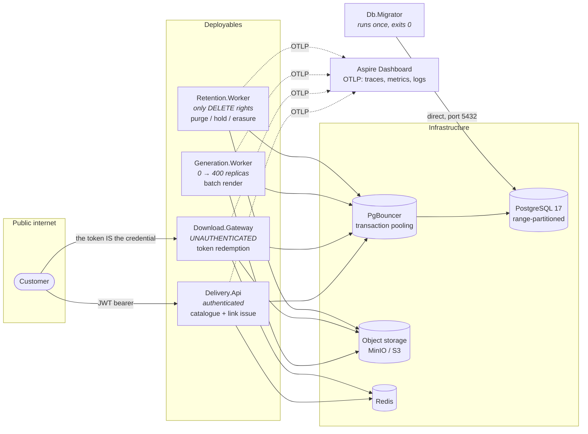

# Secure Statement Delivery Platform

[](https://github.com/OWNER/statement-delivery/actions/workflows/ci.yml)

> **Status: one vertical slice.** The platform scaffold is complete and there is now a working
> read path: a customer can authenticate and list their own statements — and cannot list anyone
> else's — with every access, including every denial, recorded in a tamper-evident hash chain.
> Tokens, encryption and PDF generation are deliberately still absent. See [Non-goals](#non-goals).

## Problem

Generate roughly **30 million PDF account statements a month**, store them encrypted and
immutably for a **seven-year regulatory retention period**, and deliver them to customers through
short-lived, single-use, non-guessable download links with a tamper-evident audit trail.

Two subsystems with opposite scaling profiles:

|  | Generation | Delivery |
| --- | --- | --- |
| Shape | Monthly burst, ~1,400 renders/sec | Steady ~0.5 req/sec, ~30 peak |
| Mode | Async batch, resumable | Synchronous, sub-second |
| Failure | Retry silently | Immediately user-visible |
| Optimise for | Throughput | Correctness and audit |

Coupling them would mean sizing the customer-facing API fleet for month-end batch load. That is
the single most important reason this is a microservices solution rather than a modular monolith,
and it is written up in [ADR-0001](docs/adr/0001-microservices-over-modular-monolith.md).

## Quickstart

```bash
git clone <repo> && cd statement-delivery
cp .env.example .env
docker compose up --build
```

That is the whole procedure. No manual steps, no seeding, no waiting and retrying: every
dependency declares a health check, the migrator runs once and gates everything behind it, and
the services start only after it exits `0`.

| What | Where |
| --- | --- |
| Delivery API (authenticated) | <http://localhost:8081> |
| Delivery API — OpenAPI / Scalar | <http://localhost:8081/scalar/v1> |
| Download Gateway (public) | <http://localhost:8082> |
| Aspire Dashboard — traces, metrics, logs | <http://localhost:18888> |
| MinIO Console | <http://localhost:9001> |
| PostgreSQL (direct — migrator only) | `localhost:5432` |
| PgBouncer (what services actually use) | `localhost:6432` |

Verify it:

```bash
docker compose ps db-migrator                  # Exited (0)
curl -f http://localhost:8081/health/live      # process is alive
curl -f http://localhost:8081/health/ready     # dependencies are reachable
curl -f http://localhost:8082/health/live
curl -f http://localhost:8082/health/ready
curl -s http://localhost:8081/ping | jq        # service, version, environment, utcNow
```

Then open <http://localhost:18888> and confirm all four services are reporting traces, metrics and
structured logs. The `traceId` in a JSON log line on stdout matches the trace in the dashboard —
that is the point of the correlation wiring.

Stop and wipe:

```bash
docker compose down --volumes
```

### Running without Docker

Every service **fails fast** if it is not fully configured — `ValidateDataAnnotations()` plus
`ValidateOnStart()`, so a missing connection string stops startup instead of surfacing on the
first request. Running `dotnet run` outside compose therefore needs the same environment variables
compose supplies; `.env.example` lists all of them.

## Architecture



Everything except the migrator reaches PostgreSQL through PgBouncer. That is not a preference:
without it the 400-replica generation fleet alone would ask for ~2,000 backends against a server
whose practical ceiling is in the low hundreds.
See [ADR-0008](docs/adr/0008-pgbouncer-transaction-pooling.md).

## Services

| Service | Port | Why it is a separate deployable |
| --- | --- | --- |
| **Delivery.Api** | 8081 | Authenticated, interactive, customer-facing. Scales with application traffic. |
| **Download.Gateway** | 8082 | Deliberately unauthenticated — the token is the credential. Different threat exposure and a different auth model. Isolating it means a flood against the public endpoint cannot exhaust the authenticated API's capacity. |
| **Generation.Worker** | — | Scales 0 → 400 replicas monthly. Coupling it to the API would mean sizing the API fleet for month-end. |
| **Retention.Worker** | — | Runs destructive operations. Separate deployment, separate identity, separate approval path. The code that deletes data should not share a process with the code that serves it. |

Shared building blocks live in `src/BuildingBlocks`:

| Project | What it owns |
| --- | --- |
| `ServiceDefaults` | OpenTelemetry, health checks, resilience, service discovery, JSON logging with redaction, RFC 9457 problem details, graceful shutdown. Every service's `Program.cs` is about fifteen lines because of it. |
| `Domain` | Statements, periods, retention policy, the audit hash-chain definition, strongly-typed identifiers. **References nothing at all** — no Npgsql, no ASP.NET Core, not even `Microsoft.Extensions.*`. Enforced by `DomainPurityTests`. |
| `Persistence` | Connection routing by intent, repositories, unit of work, the audit writer and verifier, distributed leases, UUIDv7 generation, binary COPY bulk writes, partition maintenance. Never references ASP.NET Core. |
| `Messaging` | Publisher abstraction and the transactional outbox contract. |
| `Contracts` | Integration event contracts. No project and no package references, ever. |

## Query discipline

Five rules, each describing a query that works on a laptop against a thousand rows and falls over
on a table holding 2.5 billion. They are **enforced by tests**, not just documented —
`tests/ArchitectureTests/QueryDisciplineTests.cs`.

| Rule | Why |
| --- | --- |
| **Keyset pagination only. Never `OFFSET`.** | `OFFSET` on a live table with concurrent inserts produces duplicates and gaps, degrades linearly, and defeats partition pruning. `Paging/Cursor.cs` carries the partition key so page two prunes as well as page one. |
| **Every query has an explicit timeout.** | A query with no timeout holds a pooled connection — and behind PgBouncer that is one of a few dozen shared by the whole fleet. One unbounded query becomes everybody's outage. |
| **Never `SELECT *`. Column lists only.** | Adding a column silently changes the shape of every result set that touches the table, including making a column that was never meant to leave the database appear in a projection nobody re-reviewed. |
| **No `LIST`-style unbounded scans.** | Every object in storage is reached by a key computed from the database. At 2.5 billion objects a listing is not slow, it is unusable — and billed per request. |
| **Slow queries visible in development.** | The local PostgreSQL container runs `log_min_duration_statement=200`. Finding out in production that nothing was logging slow queries is the wrong time. |

The reasoning, with the SQL shapes, is in
[`src/BuildingBlocks/Persistence/README.md`](src/BuildingBlocks/Persistence/README.md). Read the
**transaction-pooling trap list** at the top of `Connections/NpgsqlConnectionFactory.cs` before
writing any SQL at all — five PostgreSQL features do the wrong thing behind a transaction pooler,
silently, and only under load.

## Design decisions

| ADR | Decision |
| --- | --- |
| [0000](docs/adr/0000-record-architecture-decisions.md) | Record architecture decisions |
| [0001](docs/adr/0001-microservices-over-modular-monolith.md) | Split generation and delivery into separate deployables |
| [0002](docs/adr/0002-dapper-and-dbup-over-ef-core.md) | Dapper and DbUp instead of Entity Framework Core |
| [0003](docs/adr/0003-built-in-logging-over-serilog.md) | Built-in logging with the OTel exporter instead of Serilog |
| [0004](docs/adr/0004-aspire-dashboard-without-apphost.md) | Aspire Dashboard container without an AppHost |
| [0005](docs/adr/0005-partition-not-shard.md) | Partition by range, do not shard — with the arithmetic |
| [0006](docs/adr/0006-uuidv7-primary-keys.md) | Application-generated UUIDv7 primary keys |
| [0007](docs/adr/0007-partitioning-strategy.md) | Range-partition on time, require bounded date ranges |
| [0008](docs/adr/0008-pgbouncer-transaction-pooling.md) | Route all service traffic through PgBouncer |
| [0009](docs/adr/0009-denormalised-customer-id-on-statement.md) | Denormalise `customer_id` onto `statement` for hot-path authorisation |
| [0010](docs/adr/0010-sharded-audit-hash-chains.md) | Shard the audit hash chain across sixteen chains — includes the limits of what it proves |
| [0011](docs/adr/0011-canonical-serialisation-for-hashing.md) | One canonical serialisation for audit hashing |
| [0012](docs/adr/0012-404-not-403-for-unowned-resources.md) | Return 404, never 403, for resources the caller does not own |
| [0013](docs/adr/0013-mandatory-date-range-on-statement-queries.md) | Require a bounded date range on every statement query |
| [0014](docs/adr/0014-no-idempotency-replay-on-link-issue.md) | No idempotency replay on link issue — the response body holds a secret |
| [0015](docs/adr/0015-unauthenticated-redemption-endpoint.md) | The redemption endpoint is unauthenticated; the token is the credential |
| [0016](docs/adr/0016-no-range-request-support.md) | No HTTP range requests — resumability versus single use |
| [0017](docs/adr/0017-consume-before-stream.md) | Consume the token before streaming, and never release it on abort |
| [0018](docs/adr/0018-per-ip-not-per-token-rate-limiting.md) | Rate limit per IP and per customer, never per token |

Each ADR ends with a **Revisit when** section: two to four falsifiable triggers with concrete
thresholds. It turns a justification into a claim that can be shown to be wrong.

Several of these are additionally enforced as **failing tests** rather than as prose: no project
may reference Entity Framework Core or FluentAssertions; the domain layer may reference nothing at
all; no query may use `SELECT *` or `OFFSET`; and an integration test runs `EXPLAIN` and asserts a
bounded query prunes partitions. An architectural decision written only in a document is one that
gets reversed by somebody who never read it.

Also see [`docs/SCALE.md`](docs/SCALE.md), [`docs/COST.md`](docs/COST.md) and
[`docs/THREAT-MODEL.md`](docs/THREAT-MODEL.md) — heading skeletons, to be filled with measured
output rather than estimates.

## The audit trail, and the limit of what it proves

Every read, and **every denial**, is recorded in a hash-chained audit trail: each record's hash
covers its predecessor's, so removing or altering one breaks every hash after it. The chain is
sharded sixteen ways because ordering means serialisation and a single global chain would be the
throughput ceiling for the whole platform.

**What it does not prove, stated plainly.** The chain proves nothing was deleted or altered *within
a chain*, **given a trusted terminal hash**. But the chain heads live in the same database as the
events. An attacker with enough privilege to rewrite both can produce a self-consistent forgery, and
truncation from the tail is undetectable from inside. Closing that gap needs terminal hashes
anchored **outside** the database — append-only object storage under Object Lock, or an account with
independent credentials. `IChainAnchor` is the seam; the implementation is deferred and carries a
`TODO(security)`. Until it ships, treat verification as evidence against application bugs and
opportunistic tampering, **not** against a privileged insider.
See [ADR-0010](docs/adr/0010-sharded-audit-hash-chains.md).

## Non-goals

Deliberately **absent**, and absent is the correct state for this phase:

- `download_token` — no table, no entity, no endpoint. The security core deserves its own pass.
- Encryption and key management. `statement` carries `wrapped_dek`, `kek_id`, `iv` and `auth_tag`
  as nullable columns; they stay `NULL`.
- PDF generation and statement runs.
- Retention purge, legal hold enforcement, crypto-erasure. `legal_hold` and `customer_key` exist as
  tables and are unused.
- The `IChainAnchor` implementation — interface and no-op only.
- Kubernetes manifests, Helm charts, Terraform.
- An Aspire AppHost — see [ADR-0004](docs/adr/0004-aspire-dashboard-without-apphost.md).

## Running the tests

```bash
dotnet test                            # everything; integration tests skip without Docker
```

Per suite:

```bash
dotnet test --project tests/UnitTests/UnitTests.csproj
dotnet test --project tests/ArchitectureTests/ArchitectureTests.csproj
dotnet test --project tests/SecurityTests/SecurityTests.csproj
dotnet test --project tests/IntegrationTests/IntegrationTests.csproj   # needs Docker
```

Filtering — note the syntax. xUnit v3 runs on **Microsoft.Testing.Platform**, opted into by the
`test` section of `global.json`; VSTest is not supported on the .NET 10 SDK. Platform arguments go
after `--`:

```bash
dotnet test --project tests/UnitTests/UnitTests.csproj -- --filter-class "*UuidV7GeneratorTests"
```

Two things that will otherwise cost you an afternoon:

- `--nologo` is **not** a valid option for the new `dotnet test`. Passing it makes the run report
  "Zero tests ran" instead of failing with a message about the argument.
- A solution-wide `--filter` that matches nothing in some projects exits non-zero, because "zero
  tests ran" is an error per project. Filter one project at a time.

| Suite | What it covers |
| --- | --- |
| `UnitTests` | UUIDv7 monotonicity and endianness, keyset cursors, redaction rules, readiness gate. |
| `ArchitectureTests` | Layering, as executable rules. Reads the `.csproj` graph, so a reference the compiler optimises away is still caught. |
| `SecurityTests` | Controls that live in configuration: chiseled non-root images, no secrets in `appsettings`, PgBouncer pooling mode, JWT startup validation. |
| `IntegrationTests` | Real PostgreSQL via Testcontainers: migrations, GRANT enforcement, leader election and fencing, partition maintenance, `EXPLAIN` proving partition pruning, binary COPY. |

### Seeding volume

```bash
Postgres__PrimaryConnectionString='Host=localhost;Port=6432;Database=statements_generation;Username=app_generation;Password=...' \
dotnet run --project tools/seed -- --customers 100000 --months 24
```

Writes ~2.4M rows through Npgsql binary COPY, pre-creating every daily partition it needs, then
runs `ANALYZE` so the `EXPLAIN` output that goes into `docs/SCALE.md` means something.

## What's next

In rough order of what unblocks the most:

1. **`download_token` and its atomic consume** — one `UPDATE … RETURNING`, `ConnectionIntent.Write`,
   never a replica, partitioned daily and dropped rather than deleted. This is the security-critical
   path in the whole system: a token redeemable twice is a statement delivered to whoever was
   forwarded the email. The token is a 256-bit CSPRNG value, **not** a UUIDv7 — see
   [ADR-0006](docs/adr/0006-uuidv7-primary-keys.md) for why that distinction is load-bearing.
2. **Close the `TODO(security)` in `SensitiveDataRedactor`** *before* the first token exists.
   The rules already redact `/v1/d/*` and any field named `token`, `dek`, `kek` or `password`, but
   they have never been tested against a real token-issuing code path. Redaction that arrives after
   the feature is redaction that already leaked.
3. **Encryption and key management** — populate the nullable `wrapped_dek`, `kek_id`, `iv` and
   `auth_tag` columns and the `customer_key` table that already exist.
4. **A real `IChainAnchor`** — terminal hashes written to append-only object storage under Object
   Lock. Until it ships, the audit chain does not defend against a privileged insider, and the
   README says so above rather than implying otherwise.
5. **PDF generation, then retention purge and legal hold**, using the `legal_hold` table that is
   already in the schema.
